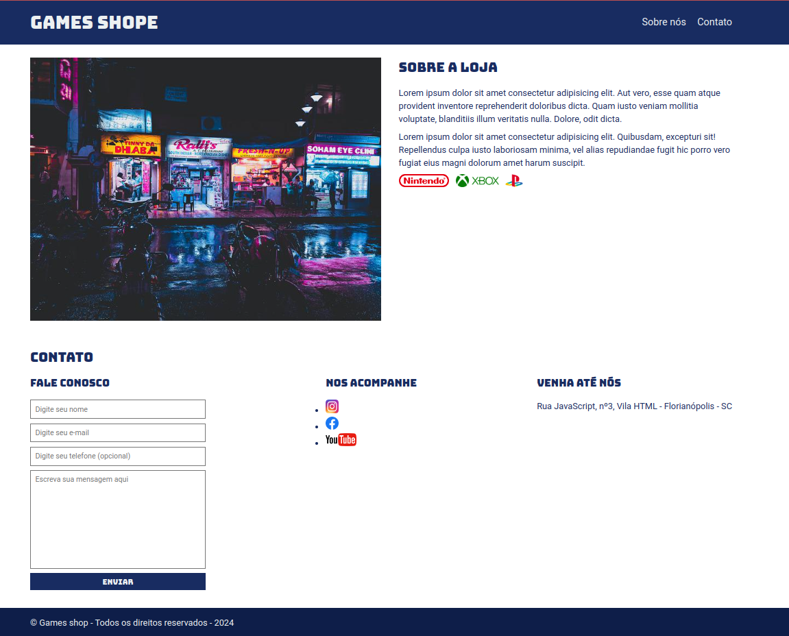

# PROJETO - GAMES SHOP

**Este projeto foi desenvolvido APENAS com o intuito de exercitar os ensinamentos domódulo de HTML e CSS aprendidos no curso da EBAC.**

- A proposta do projeto foi a criar uma Landing Page para uma loja fictícia de jogos.

## Tecnologias utilizadas

As tecnologias utilizadas para o projeto foram:

- HTML
- CSS
- GitHub

## Visualizando o projeto

Abaixo é possível visualizar a landing page desenvolvida:

## Acessando a página

Este projeto encontra-se hospedado na plataforma da Vercel.
Pode ser acessado através do link: https://ebac-projeto-1-seven.vercel.app/

## Outras considerações

**A responsividade da página não foi levada em consideração.**    

**O projeto foi puramente contruído para fins de testar algumas habilidades aprendidas durante os módulos de HTML e CSS.** 
